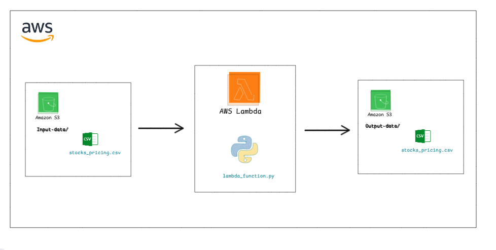

# Stock Data Processor - AWS Lambda + S3

Serverless pipeline that automatically processes stock pricing CSV files uploaded to the `Input-data/` folder in an S3 bucket, applies required transformations, adds `close_pct_change` and `created_at`, and saves the cleaned file to the `Output-data/` folder in the same bucket.

## Features
- Triggers automatically on new CSV uploads to `Input-data/`
- Converts `date` from `MM/DD/YYYY` → `YYYY-MM-DD`
- If `volume < 100000` → sets it to `'N/A'`
- If `low == 0` → replaces with average of `open` and `close`
- Calculates `close_pct_change = ((close - open) / open) * 100`
- Adds `created_at` timestamp (UTC)
- Writes processed file to `Output-data/` with the same filename
- Full error logging to CloudWatch

## Architecture





## Repository Contents
```
.
├── lambda_function.py          
├── stock_pricing.csv           
├── layers/  
├──── pandas-layer.zip                        
├── architecture_diagram.png    
└── README.md         
```

## Deployment Instructions (Step-by-Step)

### 1. Create the S3 Bucket
- Create a new S3 bucket (choose a unique name, e.g., `stock-data-processor-yourname-2025`)
- (Optional) Create two folders inside: `Input-data/` and `Output-data/`  
  → `Output-data/` will be created automatically on first run

### 2. Create IAM Role for Lambda
1. Go to IAM → Roles → Create role
2. Trusted entity: AWS service → Lambda
3. Attach policies:
   - `AWSLambdaBasicExecutionRole` (for CloudWatch Logs)
   - `AmazonS3FullAccess` (or create a custom policy with only required permissions)
4. (Optional but recommended) Add inline policy for safety:
```json
{
    "Version": "2012-10-17",
    "Statement": [
        {
            "Effect": "Allow",
            "Action": [
                "s3:GetObject",
                "s3:PutObject",
                "s3:ListBucket"
            ],
            "Resource": [
                "arn:aws:s3:::your-bucket-name",
                "arn:aws:s3:::your-bucket-name/*"
            ]
        }
    ]
}
```
5. Name the role (e.g., `stock-processor-lambda-role`) and create it.

### 3. Create the Lambda Function
1. Go to Lambda → Create function
2. Function name: e.g., `stock-data-processor`
3. Runtime: Python 3.9 (or latest)
4. Architecture: x86_64
5. Execution role → Use an existing role → select the role created above
6. Create function

### 4. Upload the Code
- In the Lambda console → Code tab → Upload from → .zip file
- Create a zip containing `lambda_function.py` (at root)`
- Or edit inline if you prefer

### 5. Add Custom Layer
1. Lambda → Layers → Create layer
2. Upload the layer zip 
3. Compatible runtimes: Python 3.9
4. Create layer
5. Back to your Lambda function → Layers → Add a layer → Choose your custom layer

### 6. Add S3 Trigger
1. In Lambda function → Add trigger
2. Select: S3
3. Bucket: your bucket
4. Event type: All object create events (or `PUT`)
5. Prefix: `Input-data/`
6. Suffix: `.csv` (recommended)
7. Save

### 7. Test the Pipeline
1. Upload the sample file (or your own) to `Input-data/` folder:
   - File name example: `stock_pricing.csv` or `stocks_data_2025-11-19.csv`
2. Wait a few seconds → Lambda will trigger automatically
3. Check `Output-data/` folder → processed file should appear with the same name
4. Verify new columns: `close_pct_change`, `created_at`, corrected date format, etc.

### 8. Monitoring & Logs
- Go to CloudWatch → Log groups → `/aws/lambda/stock-data-processor`
- View real-time logs and errors
- Any exception will be logged with traceback and returned as 500 response
# -AWS-Lambda-Pipeline
# -AWS-Lambda-Pipeline
